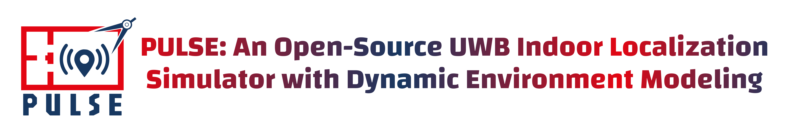
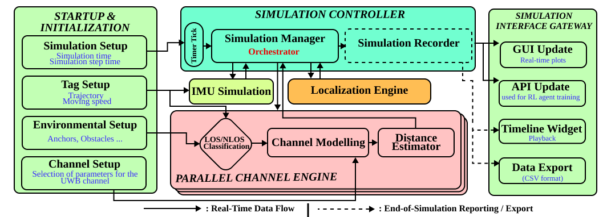
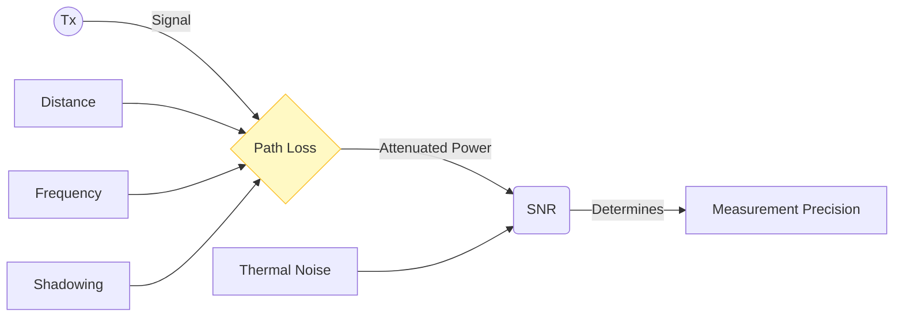
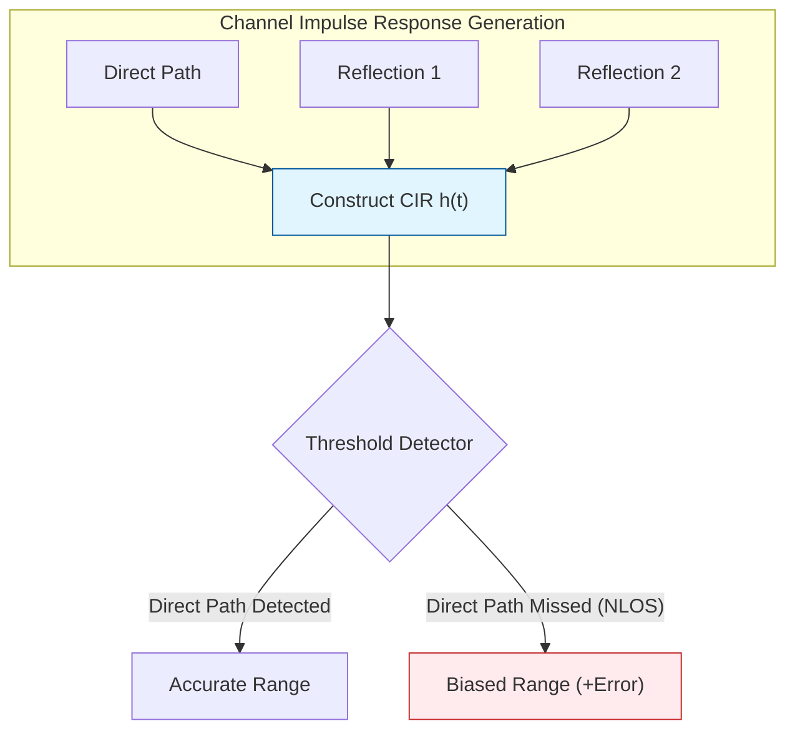

<p align="center">
  
</p>

<p align="center">
  
  &nbsp;&nbsp;&nbsp;
</p>

<p align="center">
  <a href="https://www.linkedin.com/company/granit-team-irisa/" target="_blank">
    
  </a>
  &nbsp;
  
  &nbsp;
  
  &nbsp;
  
  &nbsp;
  <a href="https://moussaart.github.io/pulse-simulator/" target="_blank">
    
  </a>
</p>

---

## 📋 Overview

**PULSE** stands for **Python Ultra-wideband Localization Simulation Engine**.

🌐 **[Official Website & Documentation](https://moussaart.github.io/pulse-simulator/)**

The **PULSE Simulation Platform** is a high-fidelity environment designed to simulate, visualize, and analyze Ultra-Wideband (UWB) indoor localization systems. It bridges the gap between theoretical algorithm design and real-world physical discrepancies by incorporating a sophisticated channel model that accounts for multipath propagation, non-line-of-sight (NLOS) conditions, and dynamic environmental factors.

This project combines a robust physics-based simulation engine with a modular Graphical User Interface (GUI), allowing researchers and engineers to:

*   **Simulate** complex UWB channel characteristics (path loss, shadowing, multipath) based on the IEEE 802.15.3a standard.
*   **Test** various localization algorithms (Trilateration, EKF, UKF, Particle Filter) under realistic indoor conditions.
*   **Visualize** signal data (CIR), estimated trajectories, and error metrics in real-time.
*   **Design** custom algorithms and scenarios using built-in tools and the algorithm wizard.

---

## ✨ Key Features

*   **🌊 Advanced Physics Engine**: Simulates multipath, shadowing, and frequency-dependent path loss based on IEEE 802.15.3a.
*   **⚡ GPU Acceleration**: CUDA-powered backend via `CuPy` for real-time simulation of thousands of multipath rays.
*   **🤖 Smart Algorithms**: Includes EKF, UKF, Adaptive EKF, and Particle Filters with NLOS mitigation.
*   **📊 Real-time Visualization**: Watch the Channel Impulse Response (CIR) live, analyze error plots, and replay trajectories.
*   **🛠️ Modular GUI**: Drag-and-drop panels, custom algorithm wizard, and interactive scenario designer.
*   **🧩 Extensibility**: Add your own localization algorithms via the built-in wizard without modifying the core engine.
*   **🔋 Energy Profiling**: Real-time estimation of tag battery life based on hardware profiles (DW3000, NXP, etc.) and communication protocols.
*   **📁 Scenario Management**: Save, load, and share simulation scenarios (anchors, trajectories, obstacles).

---

## 🚀 Getting Started

### Prerequisites

*   Python 3.8 or later
*   *(Optional)* NVIDIA GPU with CUDA support for hardware acceleration

### Installation

**Option 1 — Using the Installer (Windows)**

Download and run the provided `PULSE_Installer.exe`. The installer will configure the environment automatically.

**Option 2 — Manual Installation**

1.  Clone the repository:
    ```bash
    git clone https://github.com/your-org/PULSE-project.git
    cd PULSE-project
    ```
2.  Install the required Python packages:
    ```bash
    pip install -r requirements.txt
    ```
    Or install the core dependencies manually:
    ```bash
    pip install numpy scipy matplotlib PyQt5 pyqtgraph filterpy scikit-learn
    ```
3.  *(Optional)* For GPU acceleration, install `CuPy` matching your CUDA version:
    ```bash
    pip install cupy-cuda12x  # replace with your CUDA version
    ```

### Running the Simulation

Execute the main entry point from the project root:
```bash
python run.py
```

---

## 🏗️ System Architecture

The simulation is built on a modular architecture that cleanly separates the core physics engine from the visualization and estimation layers.



| Layer | Description |
|---|---|
| **Physics Engine** | UWB channel modeling, path loss, CIR generation |
| **Localization** | Geometric and filter-based position estimation |
| **Parallel Computing** | CUDA / CPU-fallback acceleration |
| **GUI** | Real-time visualization and user interaction |
| **API** | Interfaces for algorithm injection and data access |

---

## 📡 Physical Layer: UWB Channel Modeling

The heart of this simulator is the advanced **UWB Channel Model**, based on the **IEEE 802.15.3a** standard. Unlike simple Gaussian noise models, this engine simulates the actual physics of waveform propagation to generate realistic ranging errors.

For a comprehensive deep-dive into the physics and math, see **[UWB Modeling Documentation](docs/uwb_modeling.md)**.

### 1. Energy Loss (Path Loss & Shadowing)

The signal strength drastically affects measurement precision. We model attenuation due to:

*   **Geometric Spreading**: Distance-based power loss following the Friis equation.
*   **Frequency Dependence**: Higher frequencies attenuate faster in dense environments.
*   **Log-Normal Shadowing**: Random environmental obstructions modeled stochastically.



### 2. Time Dispersion (Multipath & CIR)

In indoor environments, signals bounce off walls, creating "echoes." The receiver sees a complex **Channel Impulse Response (CIR)** rather than a single pulse.

*   **Clusters & Rays**: Signals arrive in groups (clusters) of individual reflections (rays).
*   **NLOS Bias**: If the direct path is blocked, the receiver might trigger on a reflection, causing a positive distance bias.



---

## 🧮 Localization Algorithms

The simulator supports a wide range of algorithms, from basic geometric solutions to advanced sensor fusion filters.

| Algorithm | Description | NLOS Robust |
|---|---|---|
| **Trilateration** | Basic geometric intersection of spheres | ❌ |
| **Extended Kalman Filter (EKF)** | Linearizes non-linear range equations, fuses motion model | ✅ |
| **Adaptive EKF (AEKF)** | Dynamically adjusts noise covariances based on innovation | ✅ |
| **NLOS-Aware AEKF** | Detects and de-weights NLOS measurements | ✅✅ |
| **IMU-Fusion (IA-NAEKF)** | Integrates accelerometer data to bridge UWB gaps | ✅✅ |
| **Unscented Kalman Filter (UKF)** | Captures non-linear transformations via sigma points | ✅ |


For mathematical definitions and derivations, see **[Localization Algorithms](docs/localization_algorithms.md)**.

---

## ⚡ Hardware Acceleration

To handle the computational load of simulating thousands of multipath rays in real-time, the engine features a dedicated **Parallel Computing Module**.

### GPU Back-end

The simulation leverages **NVIDIA CUDA** via `CuPy` to accelerate heavy matrix operations.

*   **Automatic Detection**: The system automatically detects available CUDA-capable GPUs at startup.
*   **Fallback Mechanism**: Seamlessly falls back to CPU (NumPy) if no GPU is found.
*   **Key Kernels**:
    *   `cir_generation_kernel`: Parallelizes CIR generation for multiple anchors and rays.
    *   `path_loss_kernel`: Vectorized frequency-dependent path loss and shadowing computation.

The `src/core/parallel` module provides a unified `ParallelUtils` interface that keeps the core physics engine agnostic of the underlying hardware.

---

## 🔋 Energy Consumption Modeling

PULSE includes a sophisticated **Energy Estimation Module** to predict the battery life of UWB tags in various deployment scenarios.

*   **Hardware-Aware**: Includes power profiles for industry-standard chips like **Decawave DW3000** and **NXP SR150**.
*   **Protocol-Dependent**: Accounts for the different number of messages in **SS-TWR** vs. **DS-TWR**.
*   **Dynamic Simulation**: Calculates cumulative energy consumption as the agent moves through the environment.
*   **IMU Integration**: Estimates additional power draw when sensor fusion (IMU) is active.

Detailed math and hardware specs can be found in **[UWB Modeling Documentation](docs/uwb_modeling.md)**.

---

## 🖥️ Graphical User Interface (GUI)

The GUI provides a powerful dashboard for controlling the simulation and analyzing results in real-time.

### Key Modules

| Module | Description |
|---|---|
| **Simulation Control** | Start/Pause/Stop, speed control, timeline scrubbing |
| **Distance Plots** | Real-time visualization of raw ranging vs. true distance |
| **CIR Visualizer** | View Channel Impulse Response live to spot multipath effects |
| **Algorithm Wizard** | Create and edit custom localization algorithms in-app |
| **Scenario Designer** | Place anchors, draw trajectories, configure NLOS obstacles |
| **Error Metrics** | Live RMSE, CDF plots, and exportable reports |

For a full guide see **[GUI Documentation](docs/GUI_README.md)**.

---

## 📂 Project Structure

```
PULSE-project/
├── assets/                     # Application icons and branding
│   ├── logo.ico
│   └── logo.svg
│
├── data/                       # Configuration & log files
│   ├── scenarios/              # Saved simulation scenarios
│   └── logs/                   # Simulation output logs
│
├── docs/                       # Technical documentation
│   ├── assets/                 # Images & diagrams for docs
│   ├── GUI_README.md           # GUI user guide
│   ├── localization_algorithms.md
│   └── uwb_modeling.md
│
├── documentation/              # Web-based documentation (HTML)
│   └── assets/                 # Images for web docs (incl. IRISA logo)
│
├── installer/                  # Installer scripts & resources
│
├── src/                        # Main source code
│   ├── api/                    # Public API & algorithm interfaces
│   ├── app/                    # Main application entry logic
│   │   └── Localization_app.py
│   ├── core/                   # Physics & estimation engine
│   │   ├── localization/       # Kalman filters, trilateration, PF
│   │   ├── motion/             # Trajectory & motion models
│   │   ├── parallel/           # GPU/CPU acceleration (ParallelUtils)
│   │   └── uwb/                # UWB channel model & CIR generation
│   ├── gui/                    # User Interface components
│   │   ├── managers/           # State & data managers
│   │   ├── panels/             # Control panels
│   │   ├── widgets/            # Reusable UI widgets
│   │   ├── windows/            # Main and sub-windows
│   │   └── theme.py            # Global stylesheet & theme
│   ├── user_algorithms/        # User-created custom algorithms
│   └── utils/                  # Shared utilities
│
├── tests/                      # Unit & integration tests
│
├── dist/                       # Built executables
│   └── PULSE_Installer.exe
│
├── requirements.txt            # Python dependencies
├── run.py                      # Application entry point
└── README.md                   # This file
```

---

## 🔬 About the Project

### Research Context

PULSE was developed as part of a **PhD research project** focused on UWB-based indoor localization, carried out within the **[Granit Team](https://www.linkedin.com/company/granit-team-at-irisa-laboratory/posts/?feedView=all)** at **[IRISA](https://www.irisa.fr)** (Institut de Recherche en Informatique et Systèmes Aléatoires), Rennes, France.

This project has benefited from State aid managed by the **Agence Nationale de la Recherche (ANR)** under the **"France 2030"** investment program, bearing the reference **ANR-23-CMAS-0023** (**CMA RIS3 Project**), and is co-funded by **Lannion-Trégor Communauté (LTC)**.

<p align="center">
  
</p>

### Team

| Role | Name / Link |
|---|---|
| **Research Team** | [Granit Team – IRISA](https://www.linkedin.com/company/granit-team-at-irisa-laboratory/posts/?feedView=all) |
| **Lab** | [IRISA – Institut de Recherche en Informatique et Systèmes Aléatoires](https://www.irisa.fr) |

---

## 🙏 Acknowledgements & Funding

This work is part of a **PhD project** supported by the **CMA RIS3 Project**, which has benefited from State aid managed by the **Agence Nationale de la Recherche (ANR)** under the **"France 2030"** program, reference **ANR-23-CMAS-0023**.

Special thanks to our funders and partners:

*   **ANR / France 2030** : ANR-23-CMAS-0023
*   **[Lannion-Trégor Communauté (LTC)](https://www.lannion-tregor.com)** : for co-funding this research
*   **IRISA / INRIA / CNRS** : for research infrastructure and institutional support
*   **Granit Team at IRISA** : for all contributors and researchers involved

---

## 📄 License

This project is licensed under the **[MIT License](https://opensource.org/license/mit)**.

---

<p align="center">
  Made with ❤️ by the <a href="https://www.linkedin.com/company/granit-team-irisa/">Granit Team</a> at <a href="https://www.irisa.fr">IRISA</a>.
</p>
