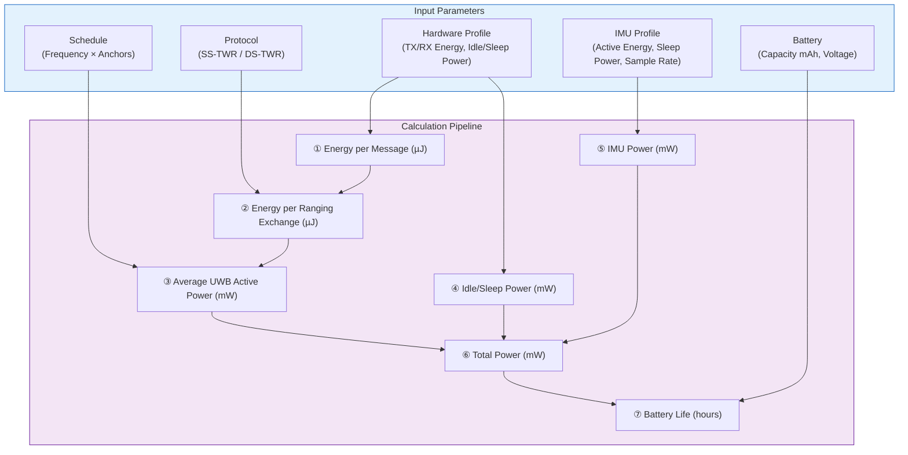
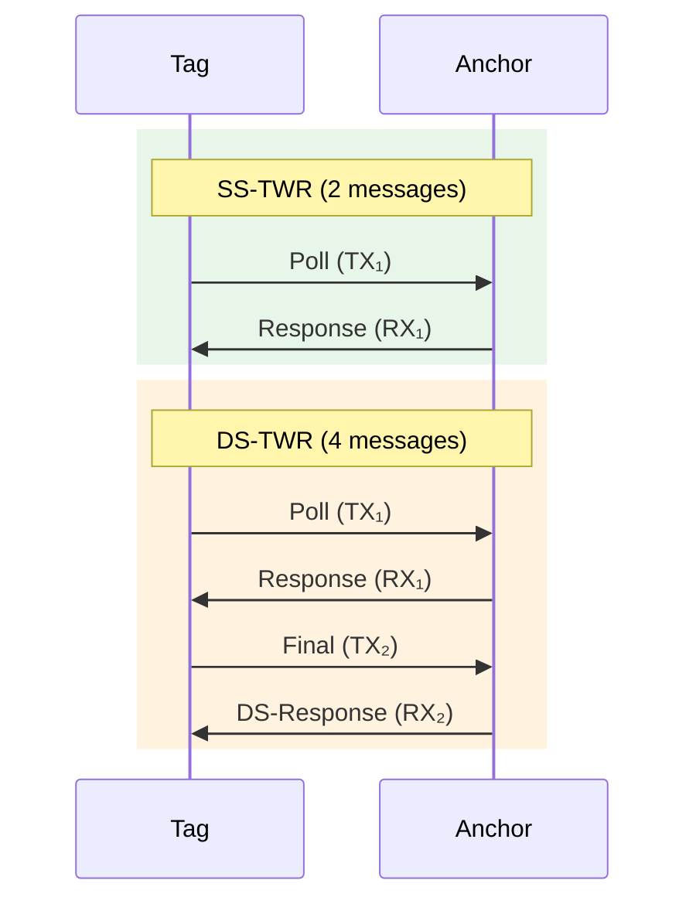
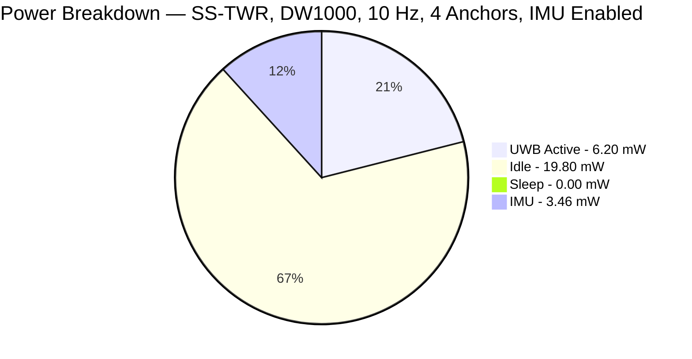
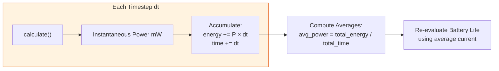

# UWB Tag Energy Consumption Model — Complete Documentation

This document provides a detailed explanation of the PULSE energy model implemented in `src/core/uwb/energy_model.py` and `src/core/uwb/device_profiles.json`. It covers the full calculation pipeline, the role and effect of every parameter, and how the IMU and UWB subsystems combine to produce the total energy consumption.

---

## 1. System Overview

The energy model answers one central question: **How long can a UWB tag run on a given battery?**

It uses an **energy-based** approach. Instead of estimating active time and computing duty cycles from voltage and current, the model takes **Energy per Operation (µJ)** directly from hardware profiles. The average power is computed by multiplying the energy per operation by the operating frequency (operations per second). 

---

## 2. Step-by-Step Calculation

### 2.1 Energy per Single Message (µJ)

Every TX or RX operation has an energy cost. These values are defined in the UWB hardware profile (e.g., `device_profiles.json`):

| Message Type | Profile Parameter | Example (DW1000) |
|---|---|---|
| **TX message** | `energy_tx_uJ` | $46.2\;\mu J$ |
| **RX message** | `energy_rx_uJ` | $108.9\;\mu J$ |

These values represent the *total* energy consumed to transmit or receive a single message, accounting for preamble, payload, and processing overhead.

---

### 2.2 Ranging Protocol — Message Count

The number of messages per ranging exchange depends on the **protocol**:

| Protocol | Tag TX Messages ($N_{TX}$) | Tag RX Messages ($N_{RX}$) | Total Messages | Description |
|----------|-----|-----|-------|-------------|
| **SS-TWR** | 1 | 1 | 2 | Tag sends Poll, receives Response |
| **DS-TWR** | 2 | 2 | 4 | Tag sends Poll+Final, receives Resp+DS-Resp |

> **Important:** DS-TWR uses **twice the energy** of SS-TWR per ranging exchange because it doubles the message count. However, DS-TWR eliminates clock-drift errors, giving higher precision. This is the fundamental **energy vs. accuracy trade-off** in the system.

---

### 2.3 Energy per Ranging Exchange (µJ)

The total energy for one ranging exchange with **one anchor** is:

$$
E_{ranging} = (E_{TX} \times N_{TX}) + (E_{RX} \times N_{RX})
$$

**Example (SS-TWR with DW1000 defaults):**

$$
E_{ranging} = (46.2 \times 1) + (108.9 \times 1) = 155.1\;\mu J
$$

**Example (DS-TWR with DW1000 defaults):**

$$
E_{ranging} = (46.2 \times 2) + (108.9 \times 2) = 310.2\;\mu J
$$

---

### 2.4 Average UWB Active Power (mW)

The average power consumed by UWB ranging operations is calculated by multiplying the energy per exchange by the frequency and the number of anchors:

$$
P_{UWB} = (E_{ranging} \times F_{update} \times N_{anchors}) \times 10^{-3}
$$

The multiplication by $10^{-3}$ converts from µW to mW (since $E_{ranging}$ is in µJ and frequency is in Hz, the product gives µJ/s = µW).

**Example (SS-TWR, 10 Hz, 4 anchors, DW1000):**

$$
P_{UWB} = (155.1 \times 10 \times 4) \times 10^{-3} = 6.204\;\text{mW}
$$

> **Note:** If UWB is disabled (`uwb_disabled = True`), then $P_{UWB} = 0$.

---

### 2.5 Idle and Sleep Power (mW)

When the radio is not ranging, it draws idle and sleep power. In this energy model, idle and sleep power are specified directly as continuous power sources in the profile.

$$
P_{idle} = \text{power\_idle\_mW}
$$
$$
P_{sleep} = \text{power\_sleep\_mW}
$$

**Example (DW1000):**

$$
P_{idle} = 19.8\;\text{mW}
$$
$$
P_{sleep} = 0.00033\;\text{mW}
$$

---

### 2.6 IMU Power (mW)

The IMU power is dependent on whether it is actively being used by the localization algorithm.
If the IMU is **enabled** (e.g., used for UWB-IMU fusion), it samples continuously at its configured sample rate. The power is calculated as energy per sample multiplied by the sample rate:

$$
P_{IMU} = (\text{energy\_active\_uJ\_per\_sample} \times \text{sample\_rate\_hz}) \times 10^{-3}
$$

If the IMU is **disabled** (e.g., pure UWB algorithm), it falls back to its sleep power configuration:

$$
P_{IMU} = \text{power\_sleep\_mW}
$$

**Example (IMU Enabled, 34.6 µJ/sample at 100 Hz):**

$$
P_{IMU} = (34.6 \times 100.0) \times 10^{-3} = 3.46\;\text{mW}
$$

---

### 2.7 Total Power (mW)

The total system power is the sum of all contributors:

$$
\boxed{P_{total} = P_{UWB} + P_{idle} + P_{sleep} + P_{IMU}}
$$

**Example:**

$$
P_{total} = 6.204 + 19.8 + 0.00033 + 3.46 = 29.464\;\text{mW}
$$

---

### 2.8 Total Current and Battery Life

The average continuous current drawn from the battery is:

$$
I_{total} = \frac{P_{total}}{V}
$$

The battery life is:

$$
\text{BatteryLife}_{hours} = \frac{\text{Capacity}_{mAh}}{I_{total}}
$$

$$
\text{BatteryLife}_{days} = \frac{\text{BatteryLife}_{hours}}{24}
$$

**Example (Using 3.3V supply and 225 mAh battery):**

$$
I_{total} = \frac{29.464}{3.3} = 8.928\;\text{mA}
$$

$$
\text{BatteryLife} = \frac{225}{8.928} = 25.2\;\text{hours} \approx 1.05\;\text{days}
$$

---

## 3. Hardware Profiles

The system supports swapping hardware profiles to instantly reconfigure energy parameters based on real datasheets. These are defined in `src/core/uwb/device_profiles.json`.

You can define custom profiles via the UI to match any combination of UWB radios and IMUs.

### Default UWB Profile (DW1000)
- `energy_tx_uJ`: 46.2
- `energy_rx_uJ`: 108.9
- `power_idle_mW`: 19.8
- `power_sleep_mW`: 0.00033

### Default IMU Profile (Generic MEMS IMU)
- `energy_active_uJ_per_sample`: 34.6
- `power_sleep_mW`: 0.0198
- `sample_rate_hz`: 100.0

---

## 4. Simulation-Time Energy Tracking

Beyond the instantaneous power calculation (`calculate()`), the model supports **cumulative energy tracking** over a simulation via `calculate_step(dt)`.

### How It Works

At each simulation step:

1. **Instantaneous energy** for the step: $E_{step} = P_{total} \times dt \times 1000$ (in µJ)
2. **Cumulative energy**: $E_{cumulative} += E_{step}$
3. **Average power** over the simulation: $P_{avg} = \frac{E_{cumulative} / 1000}{t_{total}}$ (mW)
4. **Battery life** is recalculated using the **average current**, not the instantaneous current

This enables accurate tracking when the ranging frequency or number of anchors changes dynamically during a simulation.

---

## 5. UWB-Disabled Mode (IMU-Only)

When the localization algorithm runs in **IMU-Only** mode (`uwb_disabled = True`), the UWB radio shuts down entirely:

- $P_{UWB} = 0$
- $P_{total} = P_{idle} + P_{sleep} + P_{IMU}$

Depending on how idle power is configured, this can result in dramatically extended battery life by saving the high costs associated with UWB operations.

---

## 6. Summary of Formulas

| Quantity | Formula |
|----------|---------|
| Energy per ranging exchange | $E_{rng} = (E_{TX} \times N_{TX}) + (E_{RX} \times N_{RX})$ |
| UWB active power | $P_{UWB} = (E_{rng} \times F_{update} \times N_{anchors}) \times 10^{-3}$ |
| IMU active power | $P_{IMU} = (\text{energy\_active\_uJ\_per\_sample} \times \text{sample\_rate\_hz}) \times 10^{-3}$ |
| **Total power** | $P_{total} = P_{UWB} + P_{idle} + P_{sleep} + P_{IMU}$ |
| Total current | $I_{total} = P_{total} / V$ |
| Battery life | $t_{battery} = C_{battery} / I_{total}$ |
