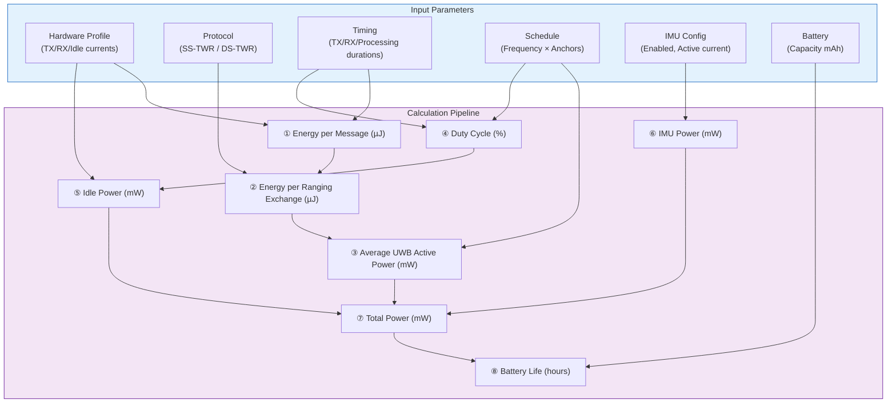
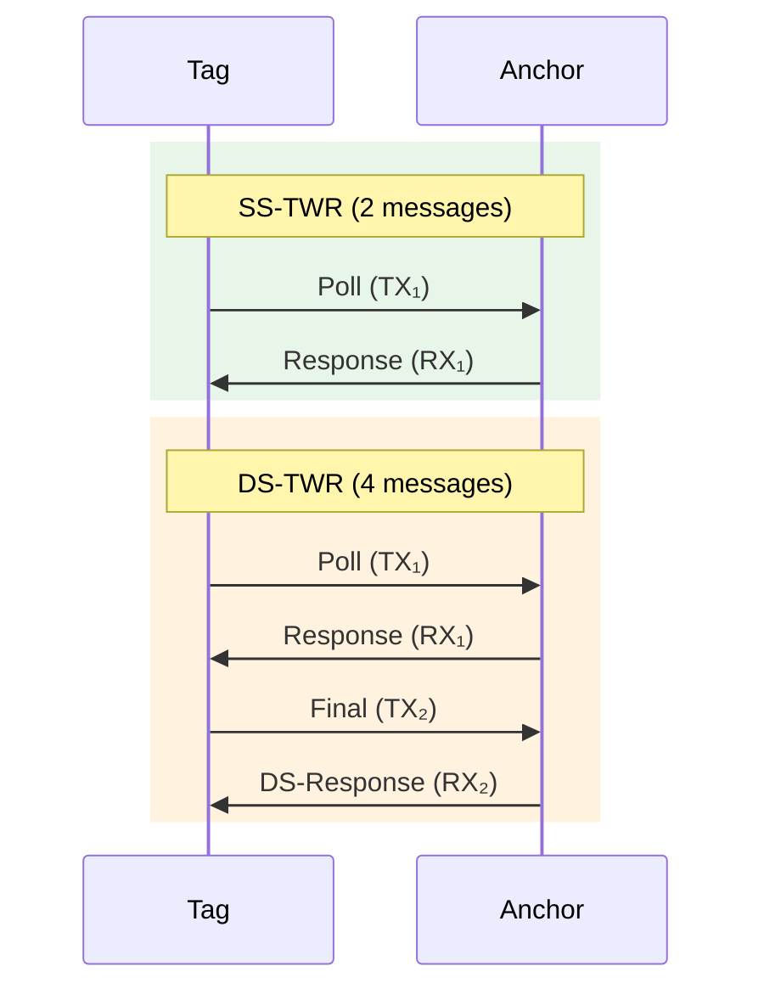
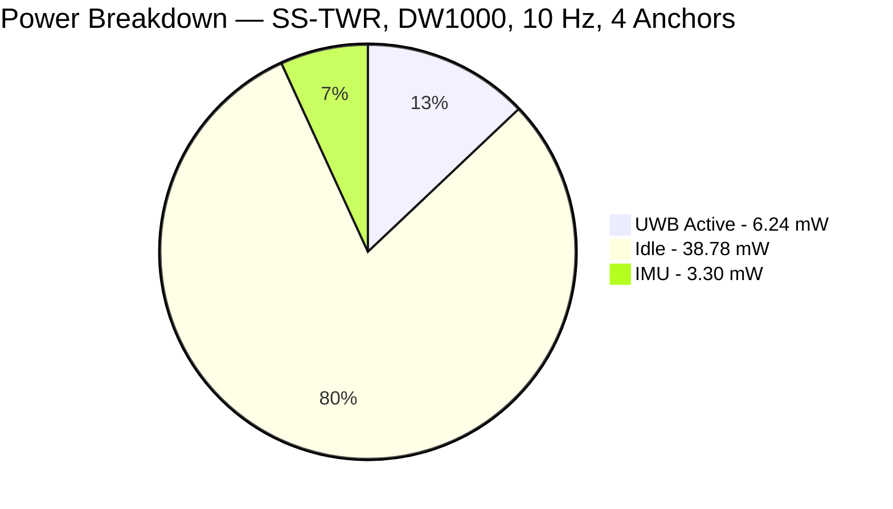
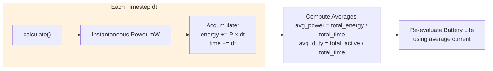

# UWB Tag Energy Consumption Model — Complete Documentation

This document provides a detailed explanation of the PULSE energy model implemented in [energy_model.py](file:///c:/Users/tmoussa/Desktop/Irisa%20Job/PULSE%20project/src/core/uwb/energy_model.py) and [uwb_hardware_profiles.json](file:///c:/Users/tmoussa/Desktop/Irisa%20Job/PULSE%20project/src/core/uwb/uwb_hardware_profiles.json). It covers the full calculation pipeline, the role and effect of every parameter, and how the IMU and UWB subsystems combine to produce the total energy consumption.

---

## 1. System Overview

The energy model answers one central question: **How long can a UWB tag run on a given battery?**

It uses a **duty-cycle based** approach — the UWB radio is not transmitting or receiving continuously; it wakes up briefly for each ranging exchange, then returns to idle/sleep. The model computes the **average power** by weighting the active and idle power by the fraction of time spent in each state.

---

## 2. Step-by-Step Calculation

### 2.1 Energy per Single Message (µJ)

Every TX or RX operation has an energy cost. The fundamental formula is:

$$
E = V \times I \times t \times 10^{-3}
$$

| Symbol | Meaning | Unit |
|--------|---------|------|
| $V$ | Supply voltage | V |
| $I$ | Current during the operation | mA |
| $t$ | Duration of the operation | µs |
| $10^{-3}$ | Unit conversion factor | — |
| $E$ | Resulting energy | µJ |

This is applied three times for each message type:

| Message Type | Formula | Default Example |
|---|---|---|
| **TX message** | $E_{TX} = V \times I_{TX} \times t_{TX} \times 10^{-3}$ | $3.3 \times 70.0 \times 200 \times 10^{-3} = 46.2\;\mu J$ |
| **RX message** | $E_{RX} = V \times I_{RX} \times t_{RX} \times 10^{-3}$ | $3.3 \times 110.0 \times 300 \times 10^{-3} = 108.9\;\mu J$ |
| **Processing** | $E_{proc} = V \times I_{proc} \times t_{proc} \times 10^{-3}$ | $3.3 \times 12.0 \times 10 \times 10^{-3} = 0.396\;\mu J$ |

> **Note:** The processing energy accounts for the MCU time spent doing computation (e.g., timestamp processing) between radio operations. It is applied once **per message** (both TX and RX messages trigger processing).

#### Why $t_{TX} = 200\;\mu s$ and $t_{RX} = 300\;\mu s$?

These default values are **not fixed by the IEEE 802.15.4a standard** — the standard allows highly variable frame durations depending on three configuration parameters:

1. **Preamble Length** (16, 64, 128, 1024, or 4096 symbols)
2. **Data Rate** (110 kbps, 850 kbps, or 6.8 Mbps)
3. **Payload Size** (0 to 127 bytes standard)

However, 200 µs and 300 µs are **accurate typical values** for the most common UWB ranging configuration: **short-range, high-data-rate** applications such as Real-Time Location Systems (RTLS).

##### Evidence from the DW1000 Datasheet

The Decawave DW1000 datasheet provides measured packet durations for standard configurations:

| Configuration | Data Rate | Preamble | Payload | Packet Duration |
|---|---|---|---|---|
| Mode D (Short Range, High Density) | 6.8 Mbps | 128 symbols | 30 bytes | **194 µs** |
| Mode B (Short Range) | 6.8 Mbps | 128 symbols | 12 bytes | **175 µs** |
| Mode A (Long Range, Low Density) | 110 kbps | 1024 symbols | 30 bytes | **3,625 µs** |

A typical high-speed packet breaks down as:
- **Synchronization Header (SHR/Preamble):** ~135 µs
- **PHY Header + Data Payload:** ~40 µs

Therefore, $t_{TX} = 200\;\mu s$ is an accurate approximation for a 6.8 Mbps configuration with a short preamble.

##### Why $t_{RX} = 300\;\mu s > t_{TX}$?

The receive window must be **longer** than the actual packet duration to account for:

1. **PLL Startup:** ~7 µs for the Phase-Locked Loop to stabilize
2. **Preamble Hunt:** Variable time searching for the incoming signal
3. **RX SHR (Synchronization Header):** ~120 µs
4. **RX PHR/PSDU (Data Demodulation):** ~40 µs
5. **Host Data Read:** ~56 µs

Opening the RX window for ~300 µs ensures the receiver has enough margin to detect, demodulate, and read the entire ~200 µs frame without missing it.

> **Warning:** These timing defaults are valid **only for high-data-rate (6.8 Mbps) configurations**. If the network uses lower data rates for extended range (e.g., 110 kbps with 1024-symbol preambles), frame durations increase to **several milliseconds** (2,443 – 11,000+ µs), and both `tx_duration_us` and `rx_duration_us` must be adjusted accordingly.

---

### 2.2 Ranging Protocol — Message Count

The number of messages per ranging exchange depends on the **protocol**:

| Protocol | Tag TX Messages ($N_{TX}$) | Tag RX Messages ($N_{RX}$) | Total Messages | Description |
|----------|-----|-----|-------|-------------|
| **SS-TWR** | 1 | 1 | 2 | Tag sends Poll, receives Response |
| **DS-TWR** | 2 | 2 | 4 | Tag sends Poll+Final, receives Resp+DS-Resp |

> **Important:** DS-TWR uses **twice the energy** of SS-TWR per ranging exchange because it doubles the message count. However, DS-TWR eliminates clock-drift errors, giving higher precision. This is the fundamental **energy vs. accuracy trade-off** in the system.

---

### 2.3 Energy per Ranging Exchange (µJ)

The total energy for one ranging exchange with **one anchor** is:

$$
E_{ranging} = E_{TX} \times N_{TX} + E_{RX} \times N_{RX} + E_{proc} \times (N_{TX} + N_{RX})
$$

**Example (SS-TWR with DW1000 defaults):**

$$
E_{ranging} = 46.2 \times 1 + 108.9 \times 1 + 0.396 \times 2 = 155.892\;\mu J
$$

**Example (DS-TWR with DW1000 defaults):**

$$
E_{ranging} = 46.2 \times 2 + 108.9 \times 2 + 0.396 \times 4 = 311.784\;\mu J
$$

---

### 2.4 Duty Cycle

The **duty cycle** is the fraction of time the UWB radio is actively transmitting or receiving:

$$
t_{active/ranging} = t_{TX} \times N_{TX} + t_{RX} \times N_{RX} + t_{proc} \times (N_{TX} + N_{RX})
$$

$$
t_{active/second} = t_{active/ranging} \times F_{update} \times N_{anchors}
$$

$$
\text{DutyCycle} = \min\left(t_{active/second},\;1.0\right)
$$

The duty cycle is capped at 100% (the radio cannot be active more than 100% of the time).

**Example (SS-TWR, 10 Hz, 4 anchors):**

$$
t_{active/ranging} = (200 \times 1 + 300 \times 1 + 10 \times 2) \times 10^{-6} = 520\;\mu s = 0.00052\;s
$$

$$
t_{active/second} = 0.00052 \times 10 \times 4 = 0.0208\;s \quad \Rightarrow \quad \text{DutyCycle} = 2.08\%
$$

> **Tip:** A low duty cycle (< 5%) is typical for UWB tags and is why they can last months on coin-cell batteries. The radio spends the vast majority of time in idle/sleep.

---

### 2.5 Average UWB Active Power (mW)

The average power consumed by UWB ranging operations:

$$
P_{UWB} = \frac{E_{ranging} \times F_{update} \times N_{anchors}}{1000}
$$

The division by 1000 converts from µW to mW (since $E_{ranging}$ is in µJ and frequency is in Hz, the product gives µJ/s = µW).

**Example (SS-TWR, 10 Hz, 4 anchors, DW1000):**

$$
P_{UWB} = \frac{155.892 \times 10 \times 4}{1000} = 6.236\;\text{mW}
$$

---

### 2.6 Idle Power (mW)

When the radio is not ranging, it draws idle current. The idle power is scaled by the **complementary duty cycle**:

$$
P_{idle} = V \times I_{idle} \times (1 - \text{DutyCycle})
$$

**Example (DW1000, 2.08% duty cycle):**

$$
P_{idle} = 3.3 \times 12.0 \times (1 - 0.0208) = 38.78\;\text{mW}
$$

> **Note:** When UWB is **disabled** (`uwb_disabled = True`, e.g., for an "IMU-Only" algorithm), the radio enters deep sleep and the idle power uses `sleep_current_mA` (typically 0.001 mA) instead of `idle_current_mA`:
> $$P_{sleep} = V \times I_{sleep} = 3.3 \times 0.001 = 0.0033\;\text{mW}$$

---

### 2.7 IMU Power (mW)

The IMU is modeled as **always-on** when enabled (continuous sampling at `imu_sample_rate_hz`):

$$
P_{IMU} = V \times I_{IMU\_active}
$$

**Example:**

$$
P_{IMU} = 3.3 \times 1.0 = 3.3\;\text{mW}
$$

> **Note:** The IMU power model is simplified — it assumes the IMU runs continuously at its active current. In reality, some IMUs have low-power modes between samples, but for typical MEMS IMUs at 100 Hz, the active current dominates.

---

### 2.8 Total Power (mW)

The total system power is the sum of all three contributors:

$$
\boxed{P_{total} = P_{UWB} + P_{idle} + P_{IMU}}
$$

**Example:**

$$
P_{total} = 6.236 + 38.78 + 3.3 = 48.316\;\text{mW}
$$

---

### 2.9 Total Current and Battery Life

$$
I_{total} = \frac{P_{total}}{V}
$$

$$
\text{BatteryLife}_{hours} = \frac{\text{Capacity}_{mAh}}{I_{total}}
$$

$$
\text{BatteryLife}_{days} = \frac{\text{BatteryLife}_{hours}}{24}
$$

**Example:**

$$
I_{total} = \frac{48.316}{3.3} = 14.64\;\text{mA}
$$

$$
\text{BatteryLife} = \frac{225}{14.64} = 15.37\;\text{hours} \approx 0.64\;\text{days}
$$

---

## 3. Effect of Each Parameter

The table below summarizes every configurable parameter, its physical meaning, and the direction and magnitude of its impact on total energy consumption.

### 3.1 Supply and Hardware Parameters

| Parameter | Default | Effect on Energy | Explanation |
|-----------|---------|-----------------|-------------|
| `voltage` | 3.3 V | **Linear ↑** | Higher voltage → proportionally higher power in every term ($P = V \times I$) |
| `tx_current_mA` | 70.0 mA | **Direct ↑** on $P_{UWB}$ | Higher TX current → more energy per transmitted message |
| `rx_current_mA` | 110.0 mA | **Direct ↑** on $P_{UWB}$ | Higher RX current → more energy per received message. RX is often the **dominant** active cost |
| `idle_current_mA` | 12.0 mA | **Direct ↑** on $P_{idle}$ | Often the **largest** contributor since the tag spends ~98% of time idle |
| `sleep_current_mA` | 0.001 mA | Negligible | Only used when UWB is fully disabled |
| `battery_capacity_mAh` | 225 mAh | **Linear ↑** on battery life | Larger battery → longer life (proportional) |

> **Warning:** The **idle current** is often the most impactful parameter! Because the duty cycle is typically < 5%, the tag spends ~95–98% of its time in idle state. Even a small change in `idle_current_mA` (e.g., from 12 mA to 5 mA) has a **larger effect** on total power than doubling the TX current.

### 3.2 Timing Parameters

| Parameter | Default | Effect on Energy | Explanation |
|-----------|---------|-----------------|-------------|
| `tx_duration_us` | 200 µs | **Linear ↑** on $E_{TX}$ and duty cycle | Longer TX frame → more energy per TX, higher duty cycle |
| `rx_duration_us` | 300 µs | **Linear ↑** on $E_{RX}$ and duty cycle | Longer RX window → more energy per RX. Often set longer than TX for guard time |
| `processing_duration_us` | 10 µs | **Minor ↑** | MCU processing between messages — small compared to radio durations |
| `processing_current_mA` | 12.0 mA | **Minor ↑** | Current during MCU processing — typically same as idle |

### 3.3 Ranging Schedule Parameters

| Parameter | Default | Effect on Energy | Explanation |
|-----------|---------|-----------------|-------------|
| `uwb_frequency_hz` | 10.0 Hz | **Linear ↑** on $P_{UWB}$ | Doubling frequency **doubles** UWB active power. Most impactful tuning knob |
| `num_anchors` | 4 | **Linear ↑** on $P_{UWB}$ | Each anchor requires a full ranging exchange. 8 anchors = 2× the energy of 4 |
| `ranging_mode` | SS-TWR | **2× jump** for DS-TWR | SS-TWR uses 2 messages; DS-TWR uses 4 messages → exactly 2× the ranging energy |

> **Important:** The **ranging frequency** and **number of anchors** have a **multiplicative** effect: $P_{UWB} \propto F_{update} \times N_{anchors}$. Going from (10 Hz, 4 anchors) to (20 Hz, 8 anchors) quadruples UWB active power.

### 3.4 IMU Parameters

| Parameter | Default | Effect on Energy | Explanation |
|-----------|---------|-----------------|-------------|
| `imu_enabled` | True | **Additive** $P_{IMU}$ | Adds a constant power term when enabled |
| `imu_active_current_mA` | 1.0 mA | **Linear ↑** on $P_{IMU}$ | Higher IMU current → more power |
| `imu_sleep_current_mA` | 0.006 mA | Not used | Reserved for future duty-cycled IMU models |
| `imu_sample_rate_hz` | 100.0 Hz | Not used in energy | Currently the IMU is modeled as always-on regardless of sample rate |

---

## 4. Hardware Profiles

The system supports swapping hardware profiles to instantly reconfigure `tx_current_mA`, `rx_current_mA`, and `idle_current_mA` based on real datasheets. These are defined in [uwb_hardware_profiles.json](file:///c:/Users/tmoussa/Desktop/Irisa%20Job/PULSE%20project/src/core/uwb/uwb_hardware_profiles.json):

| Hardware Profile | TX (mA) | RX (mA) | Idle (mA) | Relative Power | Target Application |
|---|---|---|---|---|---|
| **OL23D0 (NXP)** | 12.0 | 14.0 | 3.0 | ★☆☆☆☆ Lowest | Ultra-low-power IoT |
| **DW3300Q** | 14.0 | 16.0 | 5.0 | ★★☆☆☆ | Automotive |
| **DW3000** | 14.0 | 16.0 | 15.0 | ★★★☆☆ | General purpose |
| **SR040 (NXP)** | 22.0 | 25.0 | 5.0 | ★★☆☆☆ | Coin-cell devices |
| **SR150 (NXP)** | 30.0 | 35.0 | 10.0 | ★★★☆☆ | FiRa compatible |
| **NCJ29D5 (NXP)** | 35.0 | 40.0 | 12.0 | ★★★★☆ | Automotive high-power |
| **DWM3000 (mod)** | 40.0 | 50.0 | 15.0 | ★★★★☆ | Module with regulators |
| **DW1000 Default** | 70.0 | 110.0 | 12.0 | ★★★★★ Highest | Legacy reference |

| Device                     | Official resource                                                                                                                                                                                                                                                                       |
| -------------------------- | --------------------------------------------------------------------------------------------------------------------------------------------------------------------------------------------------------------------------------------------------------------------------------------- |
| **DW3000 (DW3110/DW3120)** | [https://www.qorvo.com/products/d/da008154](https://www.qorvo.com/products/d/da008154) (DW3000 Datasheet)                                                                                                                                                                               |
| **DW3300Q**                | [https://www.qorvo.com/products/d/da009635](https://www.qorvo.com/products/d/da009635) (DW3300Q Datasheet)                                                                                                                                                                              |
| **DWM3000 Module**         | [https://www.qorvo.com/products/p/DWM3000](https://www.qorvo.com/products/p/DWM3000) (Product page with datasheet)                                                                                                                                                                      |
| **SR040**                  | [https://www.nxp.com/products/wireless-connectivity/trimension-uwb:TRIMENSION-UWB](https://www.nxp.com/products/wireless-connectivity/trimension-uwb:TRIMENSION-UWB) and [https://www.nxp.com/docs/en/fact-sheet/UWBIOTFSA4.pdf](https://www.nxp.com/docs/en/fact-sheet/UWBIOTFSA4.pdf) |
| **SR150**                  | [https://www.nxp.com/products/wireless-connectivity/trimension-uwb:TRIMENSION-UWB](https://www.nxp.com/products/wireless-connectivity/trimension-uwb:TRIMENSION-UWB)                                                                                                                    |
| **NCJ29D5**                | [https://www.nxp.com/products/NCJ29D5](https://www.nxp.com/products/NCJ29D5)                                                                                                                                                                                                            |
| **OL23D0**                 | [https://www.nxp.com/products/wireless-connectivity/trimension-uwb/trimension-ol23d0-fully-customizable-uwb-controller-for-iot:OL23D0](https://www.nxp.com/products/wireless-connectivity/trimension-uwb/trimension-ol23d0-fully-customizable-uwb-controller-for-iot:OL23D0)            |
| **DW1000**                 | [https://www.qorvo.com/products/d/da007946](https://www.qorvo.com/products/d/da007946) (DW1000 Datasheet)                                                                                                                                                                               |

---

## 5. Simulation-Time Energy Tracking

Beyond the instantaneous power calculation (`calculate()`), the model supports **cumulative energy tracking** over a simulation via `calculate_step(dt)`.

### How It Works

At each simulation step:

1. **Instantaneous energy** for the step: $E_{step} = P_{total} \times dt \times 1000$ (in µJ)
2. **Cumulative energy**: $E_{cumulative} += E_{step}$
3. **Average power** over the simulation: $P_{avg} = \frac{E_{cumulative} / 1000}{t_{total}}$ (mW)
4. **Battery life** is recalculated using the **average current**, not the instantaneous current

This enables accurate tracking when the ranging frequency or number of anchors changes dynamically during a simulation.

---

## 6. UWB-Disabled Mode (IMU-Only)

When the localization algorithm runs in **IMU-Only** mode (`uwb_disabled = True`):

- $P_{UWB} = 0$
- $\text{DutyCycle} = 0\%$
- $P_{idle} = V \times I_{sleep}$ (deep-sleep current, ~0.001 mA)
- $P_{total} \approx P_{IMU} = 3.3\;\text{mW}$

This results in dramatically extended battery life:

$$
I_{total} = \frac{3.3}{3.3} = 1.0\;\text{mA} \quad \Rightarrow \quad \text{BatteryLife} = \frac{225}{1.0} = 225\;\text{hours} \approx 9.4\;\text{days}
$$

---

## 7. Sensitivity Analysis — What Matters Most?

Based on the mathematical structure, here is a ranked ordering of parameter impact on **total power** for a typical configuration (SS-TWR, 10 Hz, 4 anchors):

| Rank | Parameter | Mechanism | Typical Impact |
|------|-----------|-----------|----------------|
| **1** | `idle_current_mA` | $P_{idle} = V \times I_{idle} \times (1 - DC)$ | ~80% of total power (because DC ≈ 2%) |
| **2** | `uwb_frequency_hz` | $P_{UWB} \propto F_{update}$ | Linear scaling of active power |
| **3** | `num_anchors` | $P_{UWB} \propto N_{anchors}$ | Linear scaling of active power |
| **4** | `rx_current_mA` | $E_{RX} \propto I_{RX}$ | RX is usually > TX duration, so RX dominates |
| **5** | `ranging_mode` | SS-TWR → DS-TWR doubles messages | 2× active energy jump |
| **6** | `imu_active_current_mA` | $P_{IMU} = V \times I_{IMU}$ | Constant additive term (~3.3 mW) |
| **7** | `tx_current_mA` | $E_{TX} \propto I_{TX}$ | Often less impactful than RX |
| **8** | `voltage` | Affects all terms linearly | Typically fixed by hardware |
| **9** | `rx_duration_us` / `tx_duration_us` | Affects per-message energy | Usually constrained by standard |
| **10** | `processing_current_mA` / `processing_duration_us` | Minor MCU overhead | Negligible |

> **Caution:** The **idle current dominates** for low duty-cycle systems. Optimizing TX/RX currents has limited impact if the idle current remains high. When choosing hardware, prioritize low idle current (e.g., DW3300Q at 5 mA vs. DW3000 at 15 mA) for maximum battery savings.

---

## 8. Worked Example — Comparing Two Configurations

### Configuration A: DW1000 Default, SS-TWR, 10 Hz, 4 Anchors, IMU On

| Component | Power (mW) |
|-----------|------------|
| UWB Active | 6.24 |
| Idle | 38.78 |
| IMU | 3.30 |
| **Total** | **48.32** |
| **Battery Life** | **15.4 hours (0.64 days)** |

### Configuration B: DW3300Q, SS-TWR, 1 Hz, 3 Anchors, IMU On

| Step | Calculation |
|------|-------------|
| $E_{TX}$ | $3.3 \times 14.0 \times 200 \times 10^{-3} = 9.24\;\mu J$ |
| $E_{RX}$ | $3.3 \times 16.0 \times 300 \times 10^{-3} = 15.84\;\mu J$ |
| $E_{proc}$ | $3.3 \times 12.0 \times 10 \times 10^{-3} = 0.396\;\mu J$ |
| $E_{ranging}$ | $9.24 + 15.84 + 0.396 \times 2 = 25.872\;\mu J$ |
| $P_{UWB}$ | $25.872 \times 1 \times 3 / 1000 = 0.0776\;\text{mW}$ |
| Duty Cycle | $(520 \times 10^{-6}) \times 1 \times 3 = 0.00156 = 0.156\%$ |
| $P_{idle}$ | $3.3 \times 5.0 \times 0.99844 = 16.47\;\text{mW}$ |
| $P_{IMU}$ | $3.3 \times 1.0 = 3.3\;\text{mW}$ |
| **$P_{total}$** | **$0.08 + 16.47 + 3.3 = 19.85\;\text{mW}$** |
| **Battery Life** | $225 / (19.85/3.3) = 225 / 6.02 = 37.4\;\text{hours} \approx 1.56\;\text{days}$ |

> **Tip:** By switching from DW1000 to DW3300Q and reducing frequency from 10 Hz to 1 Hz, the battery life **more than doubles** from 15.4 hours to 37.4 hours. The main savings come from the lower idle current (5 mA vs 12 mA).

---

## 9. Summary of Formulas

| Quantity | Formula |
|----------|---------|
| Energy per TX message | $E_{TX} = V \cdot I_{TX} \cdot t_{TX} \cdot 10^{-3}$ |
| Energy per RX message | $E_{RX} = V \cdot I_{RX} \cdot t_{RX} \cdot 10^{-3}$ |
| Energy per processing | $E_{proc} = V \cdot I_{proc} \cdot t_{proc} \cdot 10^{-3}$ |
| Energy per ranging | $E_{rng} = E_{TX} \cdot N_{TX} + E_{RX} \cdot N_{RX} + E_{proc} \cdot (N_{TX} + N_{RX})$ |
| Active time per ranging | $t_{act} = (t_{TX} \cdot N_{TX} + t_{RX} \cdot N_{RX} + t_{proc} \cdot (N_{TX}+N_{RX})) \cdot 10^{-6}$ |
| Duty cycle | $DC = \min(t_{act} \cdot F_{update} \cdot N_{anchors},\;1.0)$ |
| UWB active power | $P_{UWB} = E_{rng} \cdot F_{update} \cdot N_{anchors} \cdot 10^{-3}$ |
| Idle power | $P_{idle} = V \cdot I_{idle} \cdot (1 - DC)$ |
| IMU power | $P_{IMU} = V \cdot I_{IMU}$ |
| **Total power** | $P_{total} = P_{UWB} + P_{idle} + P_{IMU}$ |
| Total current | $I_{total} = P_{total} / V$ |
| Battery life | $t_{battery} = C_{battery} / I_{total}$ |

---
