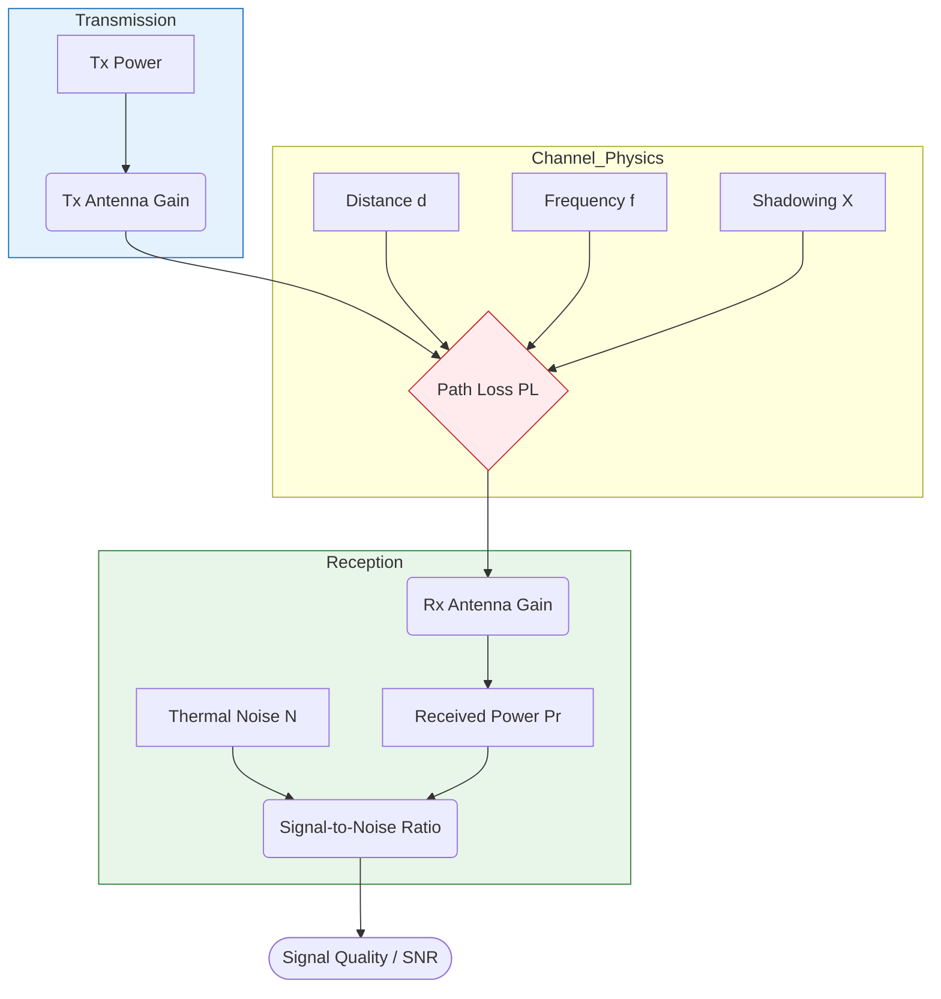
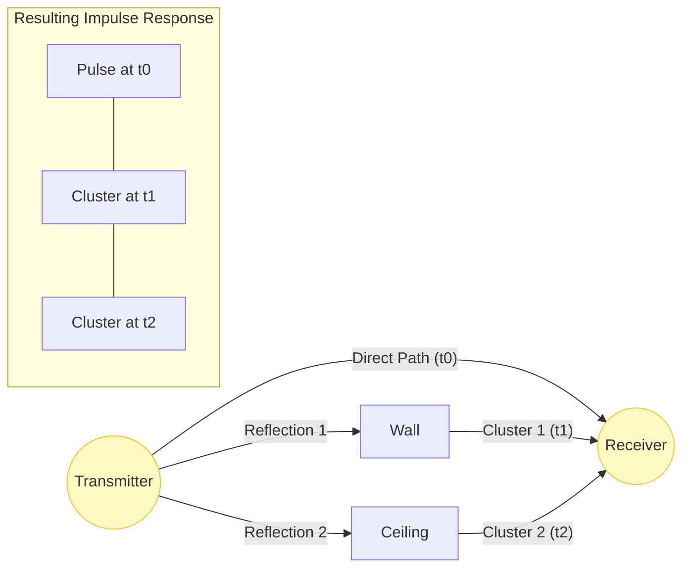
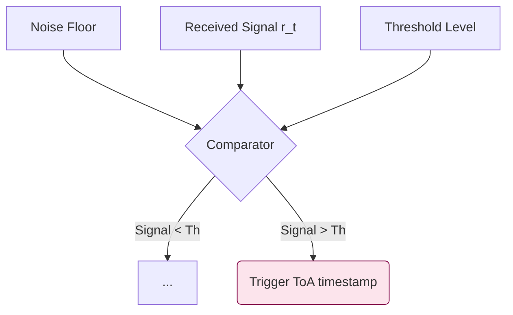
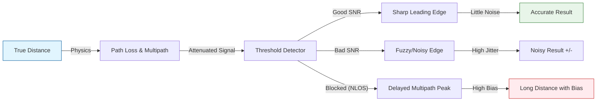
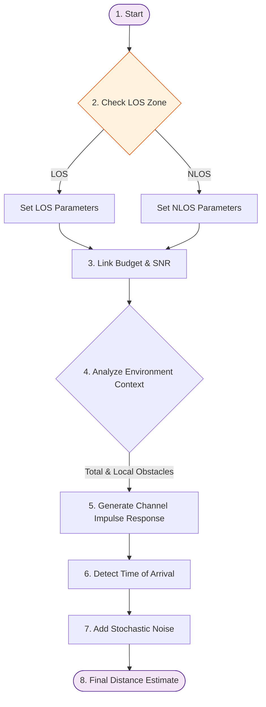

# UWB Channel Modeling: From Physics to Simulation

This document provides a comprehensive "textbook-style" explanation of the Ultra-Wideband (UWB) channel model implemented in `src/core/uwb/channel_model.py`. It breaks down the simulation into its core physical components, explaining the **Concept**, **Math**, **Visualization**, and **Effect** of each stage.

---

## 1. Introduction

The goal of this simulation is to bridge the gap between ideal geometry ($d = \sqrt{(x_1-x_2)^2 + ...}$) and the messy reality of radio frequency (RF) propagation. UWB signals are short pulses ($\sim 1$ ns) that offer high precision, but they are subject to attenuation, blockage, and multipath reflection.

Our model is based on the **IEEE 802.15.3a** standard, which statistically models these effects to generate realistic ranging errors.

---

## 2. The Physics of Propagation (Energy)

### Concept
Before a signal can be detected, it must have enough energy. As the UWB pulse travels, it loses power due to:
1.  **Geometric Spreading:** The wavefront expands like a sphere.
2.  **Frequency Dependence:** Higher frequencies attenuate faster (critical for UWB's wide bandwidth).
3.  **Shadowing:** Objects in the environment absorb or scatter energy (Log-Normal Shadowing).

### Mathematical Model
We calculate the Total Path Loss $PL(f, d)$ in Decibels (dB):

$$
PL(f, d) = \underbrace{PL_0 + 10 n \log_{10}\left(\frac{d}{d_0}\right)}_{\text{Distance Loss}} + \underbrace{20 \kappa \log_{10}\left(\frac{f}{f_c}\right)}_{\text{Frequency Loss}} + \underbrace{X_\sigma}_{\text{Shadowing}} + L_{NLOS}
$$

*   $d$: Distance.
*   $f$: Frequency.
*   $n$: Path Loss Exponent (Environmental constant, $n \approx 2$ for LOS, $n > 3$ for NLOS).
*   $X_\sigma$: Random shadowing variable $\sim \mathcal{N}(0, \sigma^2)$.

### Visualization: The Link Budget
This diagram shows how we determine if the signal is strong enough to be heard above the noise.

### Effect on Ranging
The **SNR** (Signal-to-Noise Ratio) directly limits the precision of the measurement.
*   **High SNR:** Experimental results are sharp and precise.
*   **Low SNR:** The signal is "fuzzy," leading to high **Jitter** (variance) in the distance measurement.

---

## 3. The Multipath Channel (Time)

### Concept
In an indoor environment, the receiver doesn't just hear one pulse. It hears the "echoes" of the pulse bouncing off walls, floors, and ceilings. 
*   **Clusters:** Groups of reflections arriving from major structures (e.g., a wall).
*   **Rays:** Individual reflections within a cluster.
This creates a "Time Dispersion" where the energy is spread out over time.

### Mathematical Model
The **Channel Impulse Response (CIR)** $h(t)$ is modeled using the Saleh-Valenzuela (S-V) equation:

$$
h(t) = \sum_{l=0}^{L} \sum_{k=0}^{K} \alpha_{k,l} e^{j\phi_{k,l}} \delta(t - T_l - \tau_{k,l})
$$

*   $T_l$: Arrival time of the $l$-th Cluster.
*   $\tau_{k,l}$: Arrival time of the $k$-th Ray in that cluster.
*   $\alpha_{k,l}$: Amplitude (decaying over time).

### Visualization: Clusters and Rays
Imagine the signal arriving in "bunches."

### Environment-Aware Multipath

Unlike static models that use fixed statistical averages, our model dynamically adjusts the multipath structure based on the **Physical Environment**:

1.  **Global Obstacle Density:** As the total number of obstacles in the simulation increases, the base number of clusters is boosted to account for increased background scattering.
2.  **Local Anchor Context:** If an anchor is physically located near obstacles (within a 4m radius), the simulation injects additional clusters to model immediate secondary reflections.
3.  **Arrival Rate Scaling ($\Lambda$):** In dense environments, the rate at which clusters arrive is increased. This makes the impulse response more "crowded" and complex.
4.  **Scattering Decay ($\Gamma$):** Complex environments slightly slow down the power decay, simulating the way signals "linger" in high-scattering indoor spaces.
### Effect on Ranging
Ideally, we want to detect the **Direct Path** at $t_0$. However, closely spaced multipath rays can interfere with the direct path, shifting its apparent peak or making it harder to distinguish from noise.

---

## 4. Signal Detection (The Receiver)

### Concept
The receiver must decide *when* the signal arrived. It does this by looking for the first point where the signal power crosses a **Threshold**.
*   **Leading Edge Detection:** We don't look for the peak (which might be delayed by multipath); we look for the "rising edge" of the first pulse.

### Mathematical Model
We calculate the **Received Signal** $r(t)$ by convolving the Channel Impulse Response $h(t)$ with the transmitted Pulse shape $p(t)$:

$$ r(t) = h(t) * p(t) $$

The **Time of Arrival (ToA)** is the first time $t$ where:
$$ |r(t)|^2 > \text{Threshold} $$

### Visualization: Threshold Crossing

### Effect on Ranging
*   **Late Triggering:** If the direct path is weak (attenuated) and stays below the threshold, the receiver might trigger on a later multipath component. This causes a **Positive Bias** (measured distance > true distance).
*   **Noise Triggering:** If the threshold is too low, noise might trigger a false detection (early).

---

## 5. From Time to Distance (The Error Model)

### Concept
Finally, we convert the Time of Flight ($t$) into Distance ($d = c \cdot t$). This is where all the physical effects accumulate into the final "Ranging Error."

### Mathematical Model
The measured distance $d_{meas}$ is the true distance plus errors:

$$
d_{meas} = d_{true} + \underbrace{\varepsilon_{noise}}_{\text{Noise}} + \underbrace{b_{multipath}}_{\text{Bias}}
$$

1.  **Noise (CRLB):** Random noise bounded by the Cramér-Rao Lower Bound.
    $$ \sigma_{noise} = \frac{c}{2 \pi B \sqrt{2 \cdot SNR}} $$
2.  **Bias ($b_{multipath}$):** Systematic error if the direct path is blocked or attenuated, calculated as the distance offset between the estimated and true Time of Arrival:
    $$ b_{multipath} = (ToA_{est} - ToA_{true}) \cdot c $$

### Visualization: The Error Flow
This diagram traces the entire journey from truth to measurement.

### Effect on Ranging
This is the final output of the simulation.
*   **LOS Conditions:** Result is dominated by **Noise (CRLB)** ($\varepsilon_{noise}$).
*   **NLOS Conditions:** Result is dominated by **Bias** ($b_{multipath} + b_{NLOS}$).

---

## 6. Simulation Workflow

The `measure_distance_detailed` function in the code orchestrates all these steps sequentially.

